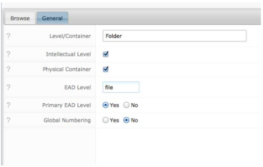
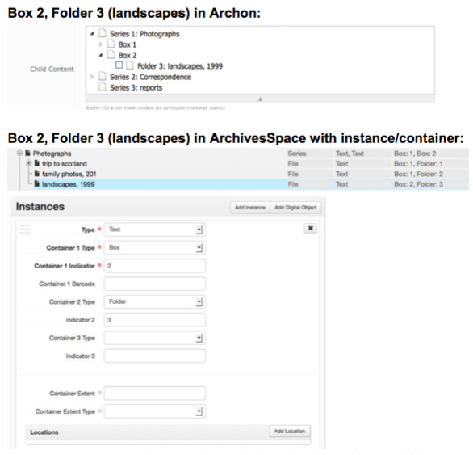
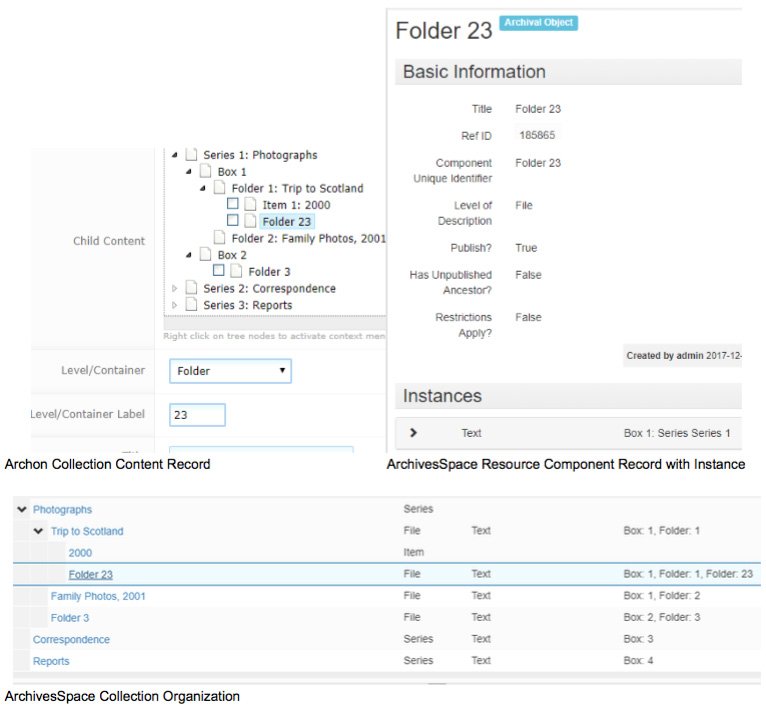
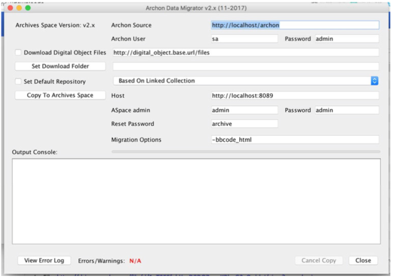

These guidelines are for migrating data from Archon 3.21-rev3 to all ArchivesSpace 2.2.2 using the migration tool provided by ArchivesSpace. Migrations of data from earlier versions of the Archon or other versions of ArchivesSpace are not supported by these guidelines or migration tool.

> Note: A migration from Archon to ArchivesSpace should not be run against an active production database.

## Preparing for migration

Select a representative sample of accession, classification, collection, collection content, and digital object records to be examined closely when the migration is completed. Make sure to include both simple and more complicated or extensive records in the sample.

Review your Archon database for data quality

### Accession Records

- Supply an accession date for all records, when possible. If an accession date is not
  recorded in Archon, the date of 01/01/9999 will be supplied during the migration process. If you wish to change this default value, you may do so by editing the following file in the new Archon distribution, prior to running the migration:
  `packages/core/templates/default/accession-list.inc.php`
- Supply an identifier for all records, when possible. If an identifier is not recorded in Archon, a supplied identifier will be constructed during the migration process, consisting of the date and the truncated accession title.

### Classification Records

Ensure that there are no duplicate classification titles at the same level in the classification hierarchy. If the migration tool encounters a duplicate value, some of the save operations for classifications will fail, and you will need to redo the migration.

### Collection Records

If normalized dates are not recorded correctly (i.e. if the end date and begin date are reversed), they will not be migrated or may cause the migration to fail. To check for such entries, a system administrator can run the follow query against the database:

`SELECT ID, Title, NormalDateBegin, NormalDateEnd FROM tblCollections_Collections WHERE NormalDateBegin > NormalDateEnd;`

### Level/Container Manager

Review the settings to make sure that each 'level container' is appropriately marked with the correct values for "Intellectual Level" and "Physical Container" and that EAD Values are correctly recorded.

Failure to code level container values correctly may result in incorrect nesting of resource components in ArchivesSpace. While the following information does not need to be acted upon prior to migration, please note the following if you find that content is not nested correctly after you migrate:

- Collection content records that have a level container that is 'Intellectual Only' will be migrated to ArchivesSpace as resource components. Each level/container that has 'intellectual level' checked should have a valid value recorded in the "EAD Level" field (i.e. class, collection, file, fonds, item, otherlevel, recordgrp, series, subfonds, subgrp, subseries). These values are case sensitive, and all other values will be migrated as "otherlevel" on the collection content/resource component records to which they apply.
- Collection content records that have a level container that is 'Physical Only' will be migrated to ArchivesSpace as instance records of the type 'text' attached to a container in ArchivesSpace. These instance/container records will be attached to the intellectual level or levels that are immediate children of the container record as it was previously expressed in Archon. If the instance/container has no children it will be attached to its parent intellectual level instead. For illustrative purposes, the following screenshots show a container record prior to and following migration.
  
- Collection content records that have both physical and intellectual levels will be migrated as both resource components and instances. In this case the instance will be attached to the resource component.
- Collection content records that are neither physical nor intellectual levels will be migrated as if they were 'Intellectual Only'. This is not recommended and should be fixed prior to migration.

### Collection Content Records

- If a value has not been set in the "Title" or "Inclusive Dates" field of an "intellectual" level/container in Archon, the collection content record being migrated will be supplied a title, based on its "label" value and the "level/container" type set in Archon.
  
- Optionally, if a migration fails, check for collection content records that reference invalid 'level/containers'. These records are found in the database tables, but are not visible to staff or end users and must be eliminated prior to migration. If not eliminated, the migration will fail. In order to identify these records, you should follow these steps. **Be very careful. If you are uncertain what you are doing, backup the database first or speak with a systems administrator!**
- In MySQL or SQL Server, open the table titled 'tblCollections_LevelContainers'. Note the 'ID' value recorded of each row (i.e. LevelContainer).
- Run a query against tblCollections_Content to find records where the LevelID column references an invalid value. For example, if tblCollections_Level Containers holds 'ID' values1-6 and 8-22:
  `SELECT * FROM tblCollections_Content WHERE LevelContainerID > 22 OR (LevelContainerID > 6 AND LevelContainerID < 8);`
  This will provide a list of all records with invalid 'LevelID' (i.e. where a record with the primary key referenced by a foreign key cannot be found). Review this list carefully to make sure you are comfortable deleting the records, or change the LevelID to a valid integer if you wish to retain the records. If you choose to delete the records, you will need to do so directly in the database (see below.) If you choose to do the latter, you may need to take additional steps directly in the database to link these records to a valid parent content record or collection; additional instructions can be supplied upon request.
- Run a query to delete the invalid records from the collections content table. For example:
  `DELETE FROM tblCollections_Content WHERE LevelContainerID > 22 OR (LevelContainerID > 6 AND LevelContainerID < 8);`
- Optionally, if the migration fails, check for 'duplicate' collection content records. 'Duplicate' records are those that occupy the same node in the collection/content hiearchy. To check for these records, run the following query in mysql or sql server.
  `SELECT ParentID, SortOrder, COUNT (*) FROM tblCollections_Content GROUP BY ParentID, SortOrder HAVING COUNT(*) > 1;`
- The query above checks for records that occupy the same branch and same position in the content hierarchy. If you discover such records, the sort order value of one of the records must be changed, so that both records occupy a unique position. In order to do this, run a query that finds all records attached to the parent record, then run an update query to change the sort order of one of the offending records so that each has a unique sort order. For example if the query above returns ParentID as a 'duplicate' value, you would run query one with the appropriate ParentID value to identify the offending records, and query two to fix the problem:
  **Query one:**

  `SELECT ID, ParentID, SortOrder, Title FROM tblCollections_Content WHERE ParentID=8619;`

  | ID   | ParentID | SortOrder | Title       |
  | ---- | -------- | --------- | ----------- |
  | 8620 | 8619     | 1         | to mother   |
  | 8621 | 8619     | 1         | from mother |
  | 8622 | 8619     | 3         | to father   |
  | 6823 | 8619     | 4         | from father |

  **Query two:**

  `UPDATE tblCollections_Content SET SortOrder=2 WHERE ID=8621;`

## Preparing for Migrating Archon Data

The migration process is iterative in nature. You should plan to do several test migrations, culminating in a final migration. Typically, migration will require assistance from a system administrator.

The migration tool will connect to your Archon installation, read data from defined 'endpoints', and place the information in a target ArchivesSpace instance.

A migration report is generated at the end of each migration routine and can be downloaded from the application. The report indicates errors or issues occurring with the migration. Sample data from migration report is provided in [Appendix A](#Appendix-A%3A-Migration-Log-Review).

You should use this report to determine if any problems observed in the migration results are best remedied in the source data or in the migrated data in the ArchivesSpace instance. If you address the problems in the source data, then you can simply clear the database and conduct the migration again. However, once you accept the migration and make changes to the migrated data in ArchivesSpace, you cannot migrate the source data again without either overwriting the previous migration or establishing a new target ArchivesSpace instance.

Please note, data migration can be a very memory and time intensive task due to the large amounts of records being transferred. As such, we recommend running the Archon migration tool on a server with at least 2GB of available memory. Test migrations have run from under an hour to twelve hours or more in the case of complex and large instances of Archon.

Before starting the migration process, make sure that your current Archon installation is up to date: i.e. that you are using version 3.21 rev3. If you are on an earlier version of Archon, make a copy of the Archon instance, including the database, to be migrated and use it as the source of the migration. It is strongly recommended that you not use your Archon production instance and database as the source of the migration for the simple reason of protecting the production version from any anomalies that might occur during the migration process. Upgrade the copy of the Archon instance to version 3.21 rev3 prior to starting the migration process.

### Get Archon to ArchivesSpace Migration Tool

Download the latest JAR file release from https://github.com/archivesspace-deprecated/ArchonMigrator/releases/latest. This is an executable JAR file – double click to run it.

### Install ArchivesSpace Instance

Implement an ArchivesSpace production version including the setting up of a MySQL database to migrate into. Instructions are included at [Getting Started with ArchivesSpace](../administration/getting_started.html) and [Running ArchivesSpace against MySQL](../provisioning/mysql.html)

### Prepare to Launch Migration

> **Important Note:** The migration process should be launched from a networked computer with a stable (i.e. wired) connection, and you should turn power save settings off on the client computer you use to launch the migration. So that the migration can proceed in an undisturbed fashion, you should not try to access the ArchivesSpace or Archon front end or public interface until after the migration as completed. **If you fail to follow these instructions, the migration tool may not provide useful feedback and it will be difficult to determine how successful the migration was.**

For the most part, the data migration process should be automatic, with errors being provided as the tool migrates and a log being made available when migration is complete. Depending on the particular data being migrated, various errors may occur These may require the migration to be re-run after they have been resolved by the user. When this occurs, the MySQL database should be emptied by the system administrator, and the migration rerun after steps are taken to resolve the problem that caused the error.

The time that the migration takes to complete will depend on a number of factors (database size, network performance etc.), but has been known to take anywhere from a half hour to ten or twelve hours. Most of this time will probably be spent migrating collection records.

The following Archon datatypes will migrate, and all relationships that exist between these datatypes should be preserved in ArchivesSpace, except as noted in bold below. For each datatype, post- migration cleanup recommendations are provided in parentheses:

- Editable controlled value lists:
  - Subject sources (review post migration and merge values with ArchivesSpace defaults or functionally duplicate values, when possible)
  - Creatorsources(reviewpostmigrationandmergevalueswithArchivesSpacedefaults
    or functionally duplicate values, when possible)
  - Extentunits/types(mergefunctionallyduplicatevalues) o MaterialTypes
  - ContainerTypes
  - FileTypes
  - ProcessingPriorities
- Repositories
- User/logins (users will need to reset password)
- Subjects (subjects of type personal corporate or family name are migrated as Agent
  records, and are linked to resources and digital objects in the subject role. Review these
  records and merge with duplicate agent names from creator migration, when possible.)
- Creators/Names
- Accessions (The migration tool will supply accession identifiers when these are blank in Archon. Review and change values, if appropriate.)
- Digital Objects: The migration tool will generate digital object metadata records in ArchivesSpace for each digital library record that is stored in your Archon instance. For each file that has an attached digital library record, the migration tool will generate a digital object component and file instance record. In addition, the migration tool will provide a folder containing the source file you uploaded to Archon when you created the record. In order to link these files to the digital file records in ArchivesSpace, you should place the files in a single directory on a webserver.
  **To preserve the linkage between the file's metadata in ArchivesSpace, you must provide the base URL to the folder where the objects will be placed.** The migration tool prepends this URL to the filename to form a complete path to the object location, for each file being exported, as shown in the screenshot below. (In version 2.2.2 of ArchivesSpace, with the default digital object templates, these files will be available in the public interface by clicking a link.)
- Locations (Controlled location records are much more granular in ArchivesSpace than in Archon. You should have a location record for each unique combination of location drop down, range, section, and shelf in Archon, and these records should be linked to top container records which are in turn linked to an instance for each collection where they apply.)
- Resources and Resource Components (see locations, above).
  Data from the following Archon modules will not migrate to ArchivesSpace
- Books (Book data could be migrated later if a plugin is developed to support this data).
- AVSAP/Assessments

## Launch Migration Process

Make sure the ArchivesSpace instance that you are migrating into is up and running, then open up the migration tool.

1. Change the default information in the migration tool user interface:
   - ArchonSource – Supply the base URL for the Archon instance.
   - Archon User – Username for an account with full administrator privileges.
   - Password – Password for that same account.
   - Download Digital Object Files checkbox – Check if you want to move any attached digital object files and supply a webpath to a web accessible folder where you intend to place the digital objects after the migration is complete.
   - Set Download Folder – Clicking this will open a file explorer that will allow you to specify the folder to which you want digital files from Archon to be downloaded.
   - Set Default Repository checkbox -- Select "Set Default Repository" checkbox to set which Repository Accession and Unlinked digital objects are copied to. The default is "Based on Linked Collection," which will copy Accession records to the same repository of any Collection records they are linked to, or the first repository if they are not. You can also select a specific repository from the drop-down list.
   - Host – The URL and port number of the ArchivesSpace backend server.
   - ASpace admin – User name for the ArchivesSpace "admin" account. The default value of "admin" should work unless it was changed by the ArchivesSpace administrator.
   - Password – Password for the ArchivesSpace "admin" account. The default value of "admin" should work unless it was changed by the ArchivesSpace administrator.
   - Reset Password – Each user account transferred has its password reset to this. Please note that users need to change their password when they first log-in unless LDAP is used for authentication.
   - Migration Options – This is needed for the functioning of the migration tool. Please do not make changes to this area.
   - Output Console – Display section for following the migration while it is running
   - View Error Log – Used to view a printout of all the errors encountered during the migration process. This can be used while the migration process is underway as well.
2. Press the "Copy to ArchivesSpace" button to start the migration process. This starts the migration to the ArchivesSpace instance indicated by the Host URL.
3. If the migration process fails: Review the error message provided and /or the migration log. Fix any issues that have been identified, clear the target MySQL and try again.
4. When the process has completed:
   - Download the migration report.
   - Move digital objects into the folder location corresponding to the URL you provided to the migration tool.

## Assessing the Migration and Cleaning Up Data

1. Use the migration report to assess the fidelity of the migration and to determine whether to fix data in the source Archon instance and conduct the migration again, or fix data in the target ArchivesSpace instance. If you select to fix data in Archon, you will need to delete all the content in the ArchivesSpace instance, then rerun the migration after clearing the ArchivesSpace database.
2. Review the following record types, making sure the correct number of records migrated. In conducting the reviews, look for duplicate or incomplete records, broken links, or truncated data.
   - Controlled vocabulary lists
   - Classifications
   - Accessions
   - Resources
   - Digital objects
   - Subjects (not persons, families, and corporate bodies)
   - Creators (known as Agents in ArchivesSpace)
   - Locations
3. Review closely the set of sample records you selected, comparing data in Archon to data in ArchivesSpace.
4. If you accept the migration in the ArchivesSpace instance, then proceed to re-establish user passwords. While user records will migrate, the passwords associated with them will not. You will need to reassign those passwords according to the policies or conventions of your repositories.

## Appendix A: Migration Log Review

The migration log provides a description of any irregularities that take place during a migration and should be saved in a secure location, for future reference. The log contains both save errors and warnings. The warnings should be reviewed after the migration for information, for potential action.

Most warnings will not require a follow up action. For example, they may note that a supplied value has been provided to meet an ArchivesSpace data model requirement. This occurs for all collections with empty identifiers. Occasionally, warnings will indicate that there was a problem establishing a link between two records for a reason such as a resource component not being found. Warnings like this should be cause for review since they may indicate that some data was lost.

Save errors will note that a particular piece of data could not be migrated because it is not supported in the ArchivesSpace data model or for some other reason. In these cases, you should review the record in Archon and in ArchivesSpace if it was migrated at all. Oftentimes, these occur due to duplicate records (such as if you have a matching creator and person subject). If a save error occurs due to a duplicate record, this is usually okay but should still be reviewed to make sure there was no data loss. If a save error occurs for any other reason, this typically means the migration will need to be rerun (unless the record it occurred on is not needed or is easier just to migrate manually).

Typically, the migration log will record the Archon internal IDs of the original Archon object being migrated whenever a save error or warning occurs. This simplifies finding and correcting relevant records.
