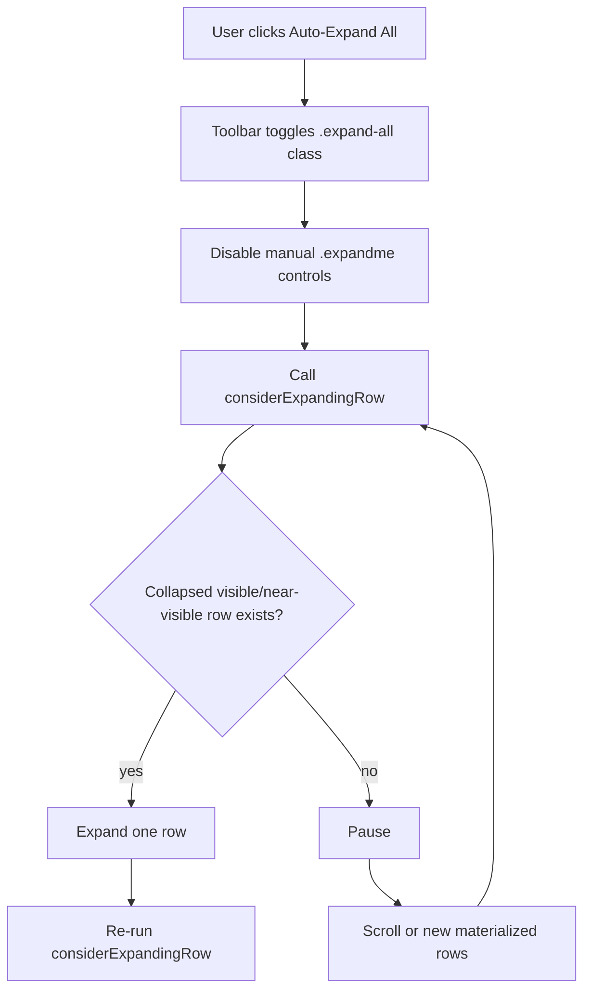
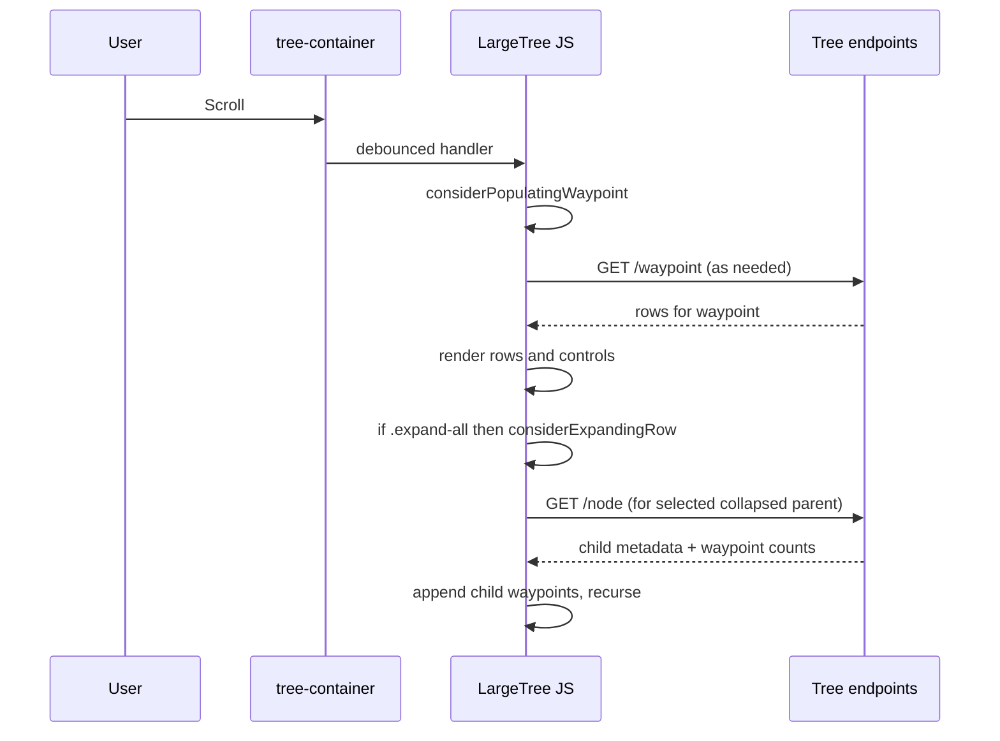

The **Auto-Expand All** button is a staff application feature that is available in the tree toolbar when editing records with children. Toggling this feature on causes the tree to expand parent nodes programatically to expose its children.This is not a one-shot "expand every parent node in the entire set right now" operation. Instead it is a **mode** for expanding parent nodes that are in and around the viewport as the user scrolls through the tree. This mode is helpful for accommodating large or deeply nested trees.

This post walks through the mode's implementation in:

- `frontend/app/assets/javascripts/tree_toolbar.js.erb`
- `frontend/app/assets/javascripts/largetree.js.erb`
- `backend/app/model/large_tree.rb`

It explains the algorithm, how scroll and lazy loading interact, and why this architecture exists.

This post grew out of a deep dive into the `largetree` while building the newer `InfiniteTree`, so we could understand the existing behavior before replacing it.

## Big idea: a tree that behaves like paginated streaming

The backend `LargeTree` model explains the core problem and solution directly in comments:

- Some archival trees are very deep or very wide under a single parent
- Loading all descendants at once can crush the browser

So the system uses "waypoints", which are fixed-size batches of children that are loaded on demand.

In `backend/app/model/large_tree.rb`, each node response includes:

- `child_count`
- `waypoints`
- `waypoint_size`
- optional `precomputed_waypoints` for a fast initial load

On the client in the browser, `largetree.js.erb` renders placeholding `.waypoint`s, then populates them as needed. This creates a virtual table-like flow where the structure comes first and the data comes later.

## The "Auto-Expand All" button is a mode switch

In `tree_toolbar.js.erb`, the button handler does four important things:

1. toggles the `.expand-all` class on the `#tree-container`
2. changes the button text and styles depending on state
3. disables the manual expand control (`.expandme`) on parent nodes
4. calls `tree.large_tree.considerExpandingRow(...)`

That last call starts the auto-expansion engine.

## Two cooperating loops run the whole feature

The key to understanding `largetree` is that two loops cooperate:

1. **Waypoint population loop** materializes rows from placeholders via `considerPopulatingWaypoint`
2. **Auto-expand loop** expands parents via `considerExpandingRow`

On scroll, `initEventHandlers` in `largetree.js.erb` waits until scrolling has paused (`SCROLL_DELAY_MS = 100`) and then runs:

1. `considerPopulatingWaypoint(...)`
2. then, if `.expand-all` is active, `considerExpandingRow()`

So the system first fetches then renders rows that are nearby, then auto-expands newly available parents that are nearby.

## How viewport-awareness works

Both main loops use similar logic to determine which rows are close enough to the viewport to act on next.

### 1) "Near viewport" threshold

`largetree.js.erb` computes:

- `emHeight = parseFloat($("body").css("font-size"))`
- `threshold_px = emHeight * THRESHOLD_EMS` (with `THRESHOLD_EMS = 300`)

'em' and 'EMS' refer to the CSS `em` relative unit of measurement. What this is doing:

- `emHeight` is the page's base text size in pixels (which by default is 16px).
- The code multiplies that by `THRESHOLD_EMS` to get a large pixel buffer around the viewport.
- By default, the threshold is `16 * 300 = 4800px`, meaning rows within about 4,800 pixels above or below the viewport are considered eligiblefor preloading and auto-expansion.

By not waiting for rows to be strictly visible before acting, the system provides a helpful user experience by preloading and expanding rows that are close enough to be relevant soon.

### 2) Start near current scroll position

Rather than scanning from the first table row every time, both loops estimate a point at which to start:

- `scrollPercent = scrollTop / rootHeight`
- `startIdx = floor(scrollPercent * collapsedExpandButtons.length)`

(This code is adapted from `largetree.js.erb` for brevity.)

What this means:

- `scrollPercent` is "how far down the tree container you are" as a fraction from 0 to 1.
- `startIdx` maps that fraction into the list of currently collapsed expand buttons, so the scan starts near the user’s current area, then scans backward and forward from that point.

This reduces unnecessary DOM checks in far-away regions and makes expansion feel local to the user's current scroll position.

### 3) Select one node row at a time

`considerExpandingRow` chooses one collapsed `.expandme` button (roughly the top-most relevant one), expands it, then calls itself again.

After each expansion finishes, the next call starts over with a fresh scan of all collapsed `.expandme` buttons that are currently in/around the viewport. So the next expansion target can be:

- a newly revealed child in the branch that just opened, or
- a different collapsed parent nearby on screen.

Here's a concrete example of three scans:

1. **First scan** sees collapsed rows `A`, `B`, `C`; it picks `A` and expands it.
2. Expanding `A` inserts new rows (for example `A.1`, `A.2`) into the DOM.
3. **Second scan** starts fresh and now sees collapsed rows `A.1`, `B`, `C`; it picks whichever row is best by current viewport position rules (not necessarily `A.1` every time).
4. **Third scan** repeats the same pattern again after the previous expansion's DOM changes.

This behavior is "re-scan and choose the next eligible row to expand within the viewport threshold" rather than "stay in one parent until all its children are fully expanded", because each expansion inserts more rows into the DOM.

## What gets fetched in auto mode vs normal mode?

The data-fetching operations are the same in both modes:

| Client method                               | Endpoint        | Purpose                                                                                |
| ------------------------------------------- | --------------- | -------------------------------------------------------------------------------------- |
| `TreeDataSource.fetchNode(uri)`             | `GET /node`     | Fetch a parent node's expansion metadata (including waypoint counts for its children). |
| `TreeDataSource.fetchWaypoint(uri, offset)` | `GET /waypoint` | Fetch one batch ("waypoint") of child rows for a given parent and batch offset.        |

In normal mode, users click a specific parent to expand it, and waypoints populate as they scroll.

In auto-expand mode, the system programmatically triggers expansions of nearby parents.

## How auto-expand mode stops or resets

There are two main ways this mode ends:

- The user toggles **Auto-Expand All** off (removing `.expand-all` and restoring manual controls).
- The user clicks **Collapse Tree**, which turns off auto-expand mode and collapses open rows.

## What comes next

This post documents the legacy `largetree` auto-expand all behavior so contributors have a reliable mental model while the tree system evolves. Future writeups will walk through the forthcoming `InfiniteTree` design and discuss how it compares with the `largetree`.
