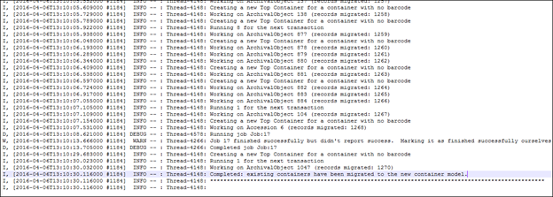
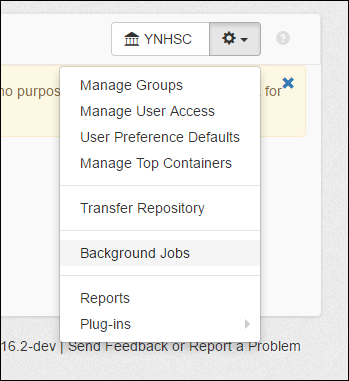
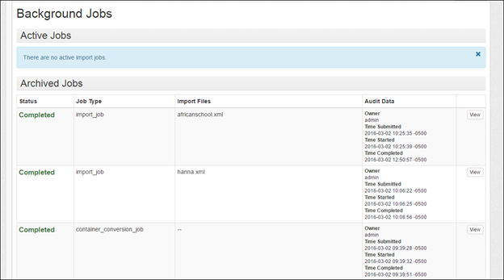
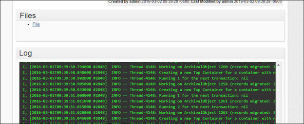
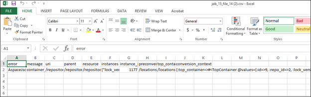

Additional upgrade considerations specific to this release, which also apply to upgrading from 1.4.2 or lower to any version through 2.0.1. Refer to the [upgrade documentation](/administration/upgrading) for the standard instructions that apply in all cases.

## General overview

The upgrade process to the new data model in 1.5.0 requires considerable data transformation and it is important for users to review this document to understand the implications and possible side-effects.

A quick overview of the steps are:

1. Review this document and understand how the upgrade will impact your data, paying particular attention to the [Preparation section](#preparation).
2. [Backup your database](/administration/backup).
3. No, really, [backup your database](/administration/backup).
4. It is suggested that [users start with a new solr index](/administration/indexes). To do this, delete the data/solr_index/index directory and all files in the data/indexer_state directory. The embedded version of Solr has been upgraded, which should result in a much more compact index size.
5. Follow the standard [upgrading instructions](/administration/upgrading). Important to note: The setup-database.sh|bat script will modify your database schema, but it will not move the data. If you are currently using the container management plugin you will need to remove it from the list of plugins in your config file prior to starting ArchivesSpace.
6. Start ArchivesSpace. When 1.5.0 starts for the first time, a conversion process will kick off and move the data into the new table structure. **During this time, the application will be unavailable until it completes**. Duration depends on the size of your data and server resources, with a few minutes for very small databases to several hours for very large ones.
7. When the conversion is done, the web application will start and the indexer will rebuild your index. Performance might be slower while the indexer runs, depending on your server environment and available resources.
8. Review the [output of the conversion process](#conversion) following the instructions below. How long it takes for the report to load will depend on the number of entries included in it.

## Preparing for and Converting to the New Container Management Functionality

With version 1.5.0, ArchivesSpace is adopting a new data model that will enable more capable and efficient management of the containers in which you store your archival materials. To take advantage of this improved functionality:

- Repositories already using ArchivesSpace as a production application will need to upgrade their ArchivesSpace applications to the version 1.5.0. (This upgrade / conversion must be done to take advantage of any other new features / bug fixes in ArchivesSpace 1.5.0 or later versions.)
- Repositories not yet using ArchivesSpace in production but needing to migrate data from the Archivists’ Toolkit or Archon will need to migrate their data to version 1.4.2 of ArchivesSpace or earlier and then upgrade that version to version 1.5.0. (This can be done when your repository is ready to migrate to ArchivesSpace.)
- Repositories not yet using ArchivesSpace in production and not needing to migrate data from the Archivists’ Toolkit or Archon can start using Archivists 1.5.0 without the need of upgrading. (People in this situation do not need to read any further.)

Converting the container data model in version 1.4.2 and earlier versions of ArchivesSpace to the 1.5.0 version has some complexity and may not accommodate all the various ways in which container information has been recorded by diverse repositories. As a consequence, upgrading from a pre-1.5.0 version of ArchivesSpace requires planning for the upgrade, reviewing the results, and, possibly, remediating data either prior to or after the final conversion process. Because of all the variations in which container information can be recorded, it is impossible to know all the ways the data of repositories will be impacted. For this reason, **all repositories upgrading their ArchivesSpace to version 1.5.0 should do so with a backup of their production ArchivesSpace instance and in a test environment.** A conversion may only be undone by reverting back to the source database.

## Frequently Asked Questions

_How will my data be converted to the new model?_

When your installation is upgraded to 1.5.0, the conversion will happen as part of the upgrade process.

_Can I continue to use the current model for containers and not convert to the new model?_

Because it is such a substantial improvement (see the [new features list](#new-features-in-150) below), the new model is required for all using ArchivesSpace 1.5.0 and higher. The only way to continue using the current model is to never upgrade beyond 1.4.2.

_What if I’m already using the container management plugin made available to the community by Yale University?_

Conversion of data created using the Yale container management plugin, or a local adaptation of the plugin, will also happen as part of the process of upgrading to 1.5.0. Some steps will be skipped when they are not needed. At the end of the process, the new container data model will be integrated into your ArchivesSpace and will not need to be loaded or maintained as a plugin.

Those currently running the container management plugin will need to remove the container management plugin from the list in your config file prior to starting the conversion or a validation name error will occur.

_I haven’t moved from Archivists’ Toolkit or Archon yet and am planning to use the associated migration tool. Can I migrate directly to 1.5.0?_

No, you must migrate to 1.4.2 or earlier versions and then upgrade your installation to 1.5.0 according to the instructions provided here.

_What changes are being made to the previous model for containers?_

The biggest change is the new concept of top containers. A top container is the highest level container in which a particular instance is stored. Top containers are in some ways analogous to the current Container 1, but broken out from the entire container record (child and grandparent container records). As such, top containers enable more efficient recording and updating of the highest level containers in your collection.

_How does ArchivesSpace determine what is a top container?_

During the conversion, ArchivesSpace will find all the Container 1s in your current ArchivesSpace database. It will then evaluate them as follows:

- If containers have barcodes, one top container is created for each unique Container 1 barcode.
- If containers do not have barcodes, one top container is created for each unique combination of container 1 indicator and container type 1 within a resource or accession.
- Once a top container is created, additional instance records for the same container within an accession or resource will be linked to that top container record.

## Preparation

_What can I do to prepare my ArchivesSpace data for a smoother conversion to top containers?_

- If your Container 1s have unique barcodes, you do not need to do anything except verify that your data is complete and accurate. You should run a preliminary conversion as described in the Conversion section and resolve any errors.
- If your Container 1s do not have barcodes, but have a nonduplicative container identifier sequence within each accession or resource (e.g. Box 1, Box 2, Box 3), or the identifiers are only reused within an accession or resource for different types of containers (for example, you have a Box 1 through 10 and an Oversize Box 1 through 3) you do not need to do anything except verify that your data is complete and accurate. You should run a preliminary conversion as described in the Conversion section and resolve any errors.
- If your Container 1s do not have barcodes and you have parallel numbering sequences, where the same indicators and types are used to refer to different containers within the same accession or resource within some or all accessions or resources (for example, you have a Box 1 in series 1 and a different Box 1 in series 5) you will need to find a way to uniquely identify these containers. One option is to run this [barcoder plugin](https://github.com/archivesspace-plugins/barcoder) for each resource to which this applies. The barcoder plugin creates barcodes that combine the ID of the highest level archival object ancestor with the container 1 type and indicator. (The barcoder plugin is designed to run against one resource at a time, instead of against all resources, because not all resources in a repository may match this condition.) Once you’ve differentiated your containers with parallel number sequences, you should run a preliminary conversion as described in the Conversion section and resolve any errors.

You do not need to make any changes to Container 2 fields or Container 3 fields. Data in these fields will be converted to the new Child and Grandchild container fields that map directly to these fields.

If you use the current Container Extent fields, these will no longer be available in 1.5.0. Any data in these fields will be migrated to a new Extent sub-record during the conversion. You can evaluate whether this data should remain in an extent record or if it belongs in a container profile or other fields and then move it accordingly after the conversion is complete.

_I have EADs I still need to import into ArchivesSpace. How can I get them ready for this new model?_

If you have a box and folder associated with a component (or any other hierarchical relationship of containers), you will need to add identifiers to the container element so that the EAD importer knows which is the top container. If you previously used Archivists' Toolkit to create EAD, your containers probably already have container identifiers. If your container elements do not have identifiers already, Yale University has made available an [XSLT transformation file](https://github.com/YaleArchivesSpace/xslt-files/blob/master/EAD_add_IDs_to_containers.xsl) to add them. You will need to run it before importing the EAD file into ArchivesSpace.

## Conversion

When upgrading from 1.4.2 (and earlier versions) to 1.5.0, the container conversion will happen as part of the upgrade process. You will be able to follow its progress in the log. Instructions for upgrading from a previous version of ArchivesSpace are available at [upgrade documentation](/administration/upgrading).

Because this is a major change in the data model for this portion of the application, running at least one test conversion is very strongly recommended. Follow these steps to run the upgrade/conversion process:

- Create a backup of your ArchivesSpace instance to use for testing. **IT IS ESSENTIAL THAT YOU NOT RUN THIS ON A PRODUCTION INSTANCE AS THE CONVERSION CHANGES YOUR DATA, and THE CHANGES CANNOT BE UNDONE EXCEPT BY REVERTING TO A BACKUP VERSION OF YOUR DATA PRIOR TO RUNNING THE CONVERSION.**
- Follow the upgrade instructions to unpack a fresh copy of the v 1.5.0 release made available for testing, copy your configuration and data files, and transfer your locales.
- **It is recommended that you delete your Solr index files to start with a fresh index** We are upgrading the version of Solr that ships with the application, and the upgrade will require a total reindex of your ArchivesSpace data. To do this, delete the data/solr_index/index directory and the files in data/indexer_state.
- Follow the upgrade instructions to run the database migrations. As part of this step, your container data will be converted to the new data model. You can follow along in the log. Windows users can open the archivesspace.out file in a tool like Notepad ++. Mac users can do a tail –f logs/archivesspace.out to get a live update from the log.
- When the test conversion has been completed, the log will indicate "Completed: existing containers have been migrated to the new container model."

- Open ArchivesSpace via your browser and login.
  Retrieve the container conversion error report from the Background Jobs area:
- Select Background Jobs from the Settings menu.

- The first item listed under Archived Jobs after completing the upgrade should be container_conversion_job. Click View.

- Under Files, click File to download a CSV file with the errors and a brief explanation.

- Go back to your source data and correct any errors that you can before doing another test conversion.
- When the error report shows no errors, or when you are satisfied with the remaining errors, your production instance is ready to be upgraded.
- When the final upgrade/conversion is complete, you can move ArchivesSpace version 1.5.0 into production.

_What are some common errors or anomalies that will be flagged in the conversion?_

- A container with a barcode has different indicators or types in different records.
- A container with a particular type and indicator sometimes has a barcode and sometimes doesn’t.
- A container is missing a type or indicator.
- Container levels are skipped (for example, there is a Container 1 and a Container 3, but no Container 2).
- A container has multiple locations.

The conversion process can resolve some of these errors for you by supplying or deleting values as it deems appropriate, but for the most control over the process you will most likely want to resolve such issues yourself in your ArchivesSpace database before converting to the new container model.

_Are there any known conversion issues?_

Due to a change in the ArchivesSpace EAD importer in 2015, some EADs with hierarchical containers not designated by a @parent attribute were turned into multiple instance records. This has since been corrected in the application, but we are working on a plugin (now available at [Instance Joiner Plugin](https://github.com/archivesspace-plugins/instance_joiner) that will enable you to turn these back into single instances so that subcontainers are not mistakenly turned into top containers.

## New features in 1.5.0

**Top containers replace Container 1s.** Unlike Container 1s in the current version of ArchivesSpace, top containers in the upcoming version can be defined once and linked many times to various archival objects, resources, and accessions.

**The ability to create container profiles and associate them with top containers.** Optional container profiles allow you to track information about the containers themselves, including dimensions.

**Extent calculator.** In conjunction with container profiles, the new extent calculator allows you to easily see extents for accessions, resources, or resource components. Optionally, you can use the calculator to generate extent records for an accession, resource, or resource component.

**Bulk operations for containers.** The Manage Top Containers area provides more efficient ways to work with multiple containers, including the ability to add or edit barcodes, change locations, and delete top containers in bulk.

**The ability to "share" boxes across collections in a meaningful way.** You can define top containers separately from individual accessions and resources and access them from multiple accession and resource records. For example, this might be helpful for recording information about an oversize box that contains items from many collections.

**The ability to store data that will help you synchronize between ArchivesSpace and item records in your ILS.** If your institution creates item records in its ILS for containers, you can now record that information within ArchivesSpace as well.

**The ability to store data about the restriction status of material associated with a container.** You can now see at a glance whether any portion of the contents of a container is restricted.

**Machine-actionable restrictions.** You will now have the ability to associate begin and end dates with "conditions governing access" and "conditions governing use" Notes. You'll also be able to associate a local restriction type for non-time-bound restrictions. This gives the ability to better manage and re-describe expiring restrictions.

For more information on using the new features, consult the user manual, particularly the new section titled Managing Containers (available late April 2016).
