ArchivesSpace is divided into several components:

- the backend, which exposes the major workflows and data types of the system via a REST API,
- a staff interface,
- a public interface,
- a search system, consisting of Solr and an indexer application.

These components interact by exchanging JSON data. The format of this data is defined by a class called JSONModel.

