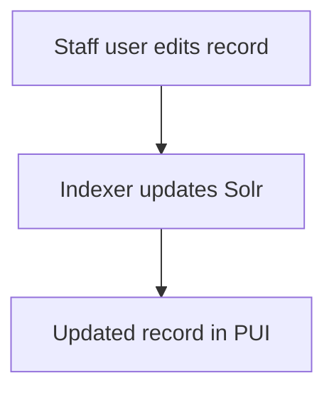

The Tech Docs site contains two types of content--documentation pages and blog posts. Both content types are written in [Markdown](https://en.wikipedia.org/wiki/Markdown) and define page-specific details as [yaml](https://yaml.org/) key:value pairs.

Tech Docs uses [GitHub-flavored Markdown](https://github.github.com/gfm/), a variant of Markdown syntax, and [SmartyPants](https://daringfireball.net/projects/smartypants/), a typographic punctuation plugin. These tools provide authors niceties like generating clickable links from text, creating lists and tables, formatting for quotations and em-dashes, and more.

## Where pages go

### Documentation pages

Documentation pages live under `src/content/docs/`. Each page is a `.md` or `.mdx` file. The URL path is `/` plus the file path relative to that directory, without the extension—for example, `src/content/docs/architecture/public.md` is served at `/architecture/public`. Nested folders add segments to the path.

### Blog

Blog posts live under `src/content/blog/` as `.md` or `.mdx` files. The URL is `/blog/` plus the path to the file relative to that folder, without the extension—for example, `src/content/blog/v4-2-0-release-candidate.md` is served at `/blog/v4-2-0-release-candidate`. Nested folders add path segments to the URL.

Valid frontmatter and body content are required for the site to be built and published.

## Markdown

Common use of Markdown throughout Tech Docs includes:

- [headings](#headings)
- [links](#links)
- [emphasizing text](#emphasizing-text)
- [paragraphs](#paragraphs)
- [lists](#lists)
- [code examples](#code-examples)
- [diagrams](#diagrams)
- [asides](#asides)
- [images](#images)

### Headings

Start a new line with between 2 and 6 `#` symbols, followed by a single space, and then the heading text.

```md
## Example second-level heading
```

The number of `#` symbols corresponds to the heading level in the document hierarchy. **The first heading level is reserved for the page title** (available in the page [YAML frontmatter](#yaml-frontmatter)). Therefore the first _authored_ heading on every page should be a second level heading (`##`).

:::note[Second level heading requirement]
Authored headings should start at the second level (`##`) on every page, since the first level (`#`) is reserved for the page title which is machine-generated.
:::

```md
<!-- example.md -->

## Second level heading

Notice the page starts with a second level heading.

Notice the blank lines above and below each heading.

### Third level heading

This is demo text under the Third level heading section.

#### Fourth level heading

##### Fifth level heading

###### Sixth and final level heading
```

### Links

Create a link by wrapping the link text in brackets (`[ ]`) immediately followed by the external link URL, or internal link path, wrapped in parentheses (`( )`).

```md
[text](URL or path)
```

Be sure not to include any space between the wrapped text and URL.

```md
<!-- example.md -->

See the [TechDocs source code](https://github.com/archivesspace/tech-docs).
```

#### In documentation pages

##### To other pages

When linking to another Tech Docs documentation page, start with a forward slash (`/`), followed by the location of the page as found in the `src/content/docs/` directory, and omit the file extension (`.md`).

```md
✅ [Public user interface](/architecture/public)

❌ [Public user interface](architecture/public)
❌ [Public user interface](./architecture/public)
❌ [Public user interface](../architecture/public)
❌ [Public user interface](/architecture/public.md)
```

:::note[Internal link requirements]
Links to other Tech Docs documentation pages should:

1. start with a forward slash (`/`)
2. reflect the location of the page as found in `src/content/docs/`
3. not include the file extension (`.md`)

:::

##### Within a page

Starlight provides [automatic heading anchor links](https://starlight.astro.build/guides/authoring-content/#automatic-heading-anchor-links). To link to a section within a page, use the `#` symbol followed by the HTML `id` of the relevant section heading.

```md
<!-- src/content/docs/about/authoring.md -->

See the [Links](#links) section on this page.

See the [Public configuration options](/architecture/public#configuration).
```

:::tip
A section heading's `id` is usually the same text string as the heading itself, but in all lowercase letters and with all single spaces converted to single hyphens. See the actual HTML `id` by right clicking on the heading to "inspect" it.
:::

#### In blog posts

When you write the body of a blog post, links to documentation pages use the same pattern as [in documentation pages](#to-other-pages): a leading `/` and the path under `src/content/docs/` without `.md`, for example `[Public user interface](/architecture/public)`.

Links to another blog post use `/blog/` plus that post’s path under `src/content/blog/` without the extension—the same shape as its public URL (see [Blog](#blog) under [Where pages go](#where-pages-go)). For example, `src/content/blog/v4-2-0-release-candidate.md` is linked as `[v4.2.0 release candidate](/blog/v4-2-0-release-candidate)`. Nested folders add segments, for example `/blog/releases/v4-2-0` for `src/content/blog/releases/v4-2-0.md`.

### Emphasizing text

Wrap text to be emphasized with `_ ` for italics, `**` for bold, and `~~` for strikethrough.

```md
<!-- example.md -->

_Italicized_ text

**Bold** text

**_Bold and italicized_** text

~~Strikethrough~~ text
```

### Paragraphs

Create paragraphs by leaving a blank line between lines of text.

```md
<!-- example.md -->

This is one paragraph.

This is another paragraph.
```

### Lists

Precede each line in a list with a dash (`-`) for a bulleted list, or a number followed by a period (`1.`) for an ordered list.

```md
<!-- example.md -->

- Resource
- Digital Object
- Accession

1. Accession
2. Digital Object
3. Resource
```

### Code examples

Wrap inline code with a single backtick (`` ` ``).

Wrap code blocks with triple backticks (` ``` `), also known as a "code fence", placed just above and below the code. Append the name of the code's language or its file extension to the first set of backticks for syntax highlighting.

````md
<!-- example.md -->

The `JSONModel` class is central to ArchivesSpace.

```ruby
def h(str)
  ERB::Util.html_escape(str)
end
```
````

### Diagrams

Tech Docs supports [Mermaid](https://mermaid.js.org/) diagrams in both documentation pages and blog posts.

Use a fenced code block with `mermaid` as the language:

````md

````

Rendered example:


### Asides

Asides are useful for highlighting secondary or marketing information.

Wrap content in a pair of triple colons (`:::`) and append one of the aside types (ie: `note`) to the first set of colons. The aside types are `note`, `tip`, `caution`, and `danger`, each of which have their own set of colors and icon. Customize the title by wrapping text in brackets (`[ ]`) placed after the note type.

```md
<!-- example.md -->

:::tip
Become an ArchivesSpace member today! 🎉
:::

:::note[Some custom title]

### Markdown is supported in asides


Lorem ipsum dolor sit amet consectetur, adipisicing elit.
:::
```

:::note
Asides are a custom Markdown feature provided by the underlying [Starlight framework](https://starlight.astro.build/guides/authoring-content/#asides) that builds the Tech Docs.
:::

:::tip[Customize the aside title]
Customize the the aside title by wrapping text in brackets (`[ ]`) after the note type, in this case `tip`.
:::

### Images

Show an image using an exclamation point (`!`), followed by the image's [alt text](https://en.wikipedia.org/wiki/Alt_attribute) (a brief description of the image) wrapped in brackets (`[ ]`), followed by the external URL, or internal path, wrapped in parentheses (`( )`).

```md
<!-- example.md -->


```

:::note[Put images in `src/images`]
All internal images belong in the `src/images` directory. The relative path to images from this file is `../../../images`.
:::

## YAML frontmatter

Each content file starts with [YAML](https://yaml.org/) frontmatter: metadata in a block wrapped in triple dashes (`---`). Use the templates below so every field we rely on is set explicitly. For more on how the site build system reads these values, see [Documentation content collection and schema](/about/development#documentation-content-collection-and-schema) and [Blog content collection and schema](/about/development#blog-content-collection-and-schema) on the Development page.

### Documentation pages

```md
---
title: Using MySQL
description: Instructions for how to set up MySQL with ArchivesSpace.
---
```

- **`title`** — Page title shown in the layout, browser tab, and metadata.
- **`description`** — Short summary used for SEO, search, and social previews.

### Blog posts

```md
---
title: v4.2.0 Release Candidate
metaDescription: Early access to ArchivesSpace v4.2.0-RC1 is now available.
teaser: ArchivesSpace <a href="https://github.com/archivesspace/archivesspace/releases/tag/v4.2.0-RC1">v4.2.0-RC1</a> has landed for early testing.
pubDate: 2026-03-20
authors:
  - Pat Doe
updatedDate: 2026-03-21
---
```

- **`title`** — Post headline on the post page and on the blog index.
- **`metaDescription`** — Short summary for page metadata (SEO) and for the index card when `teaser` is omitted.
- **`teaser`** — Text or HTML for the blog index card (links and light markup are common here).
- **`pubDate`** — Publication date; posts are ordered by this value, newest first. Use an ISO-style date (`YYYY-MM-DD`).
- **`authors`** — List of author names, shown comma-separated on the index and post page.
- **`updatedDate`** — Last-updated date in the same `YYYY-MM-DD` form when the post is revised after publication.

## Image files

All internal image files used in Tech Docs content should go in the `src/images` directory, located at the root of this project.

## Writing conventions

- Plugins, not plug-ins
- Titles are sentence-case ("Application monitoring with New Relic")
- Documentation page titles prefer '-ing' verb forms ("Using MySQL", "Serving over HTTPS")
